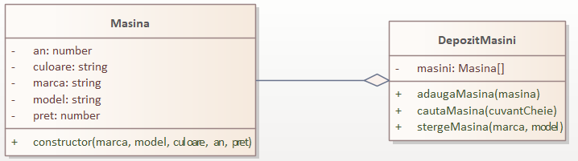
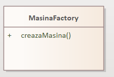
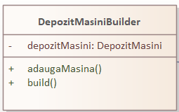
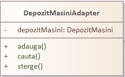
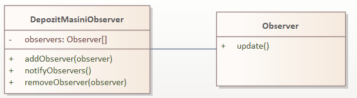

<h1 align = center>Princiipiile SOLID</h1>

## 1. Principiul responsabilității unice (Single Responsibility Principle - SRP):
#### Acest principiu prevede că o clasă ar trebui să aibă o singură responsabilitate și să aibă un singur motiv pentru a fi modificată. În codul dat, putem observa respectarea acestui principiu prin separarea responsabilităților în diferite clase.

+ Clasa "Masina" se ocupă doar de definirea unei mașini și nu are alte responsabilități.
  ```js 
  class Masina {
    constructor(marca, model, culoare, an, pret) {
      this.marca = marca;
      this.model = model;
      this.an = an;
      this.pret = pret;
      this.culoare = culoare;
    }
  }
  ```
+ Clasa "DepozitMasini" gestionează operațiile pe colecția de mașini, cum ar fi adăugarea, ștergerea și căutarea mașinilor.
    ```js 
    class DepozitMasini {
    constructor() {
      this.masini = [];
    }
  
    adaugaMasina(masina) {
      this.masini.push(masina);
    }
  
    stergeMasina(marca, model) {
      const index = this.masini.findIndex(m => m.marca === marca && m.model === model);
      if (index !== -1) {
        this.masini.splice(index, 1);
      }
    }
  
    cautaMasina(cuvantCheie) {
      return this.masini.filter(m => m.marca.includes(cuvantCheie) || m.model.includes(cuvantCheie));
    }
  }
    ```
  
### Schema UML

### Descriere
+ Clasa DepozitMasini are o relație de agregare cu clasa Masina. Adică, un depozit de mașini conține mai multe obiecte de tip mașină.
+ Clasa Masina reprezintă o entitate care are atributele marca, model, culoare, an și pret. Aceasta este clasa de bază pentru obiectele de tip mașină.

+ Clasa DepozitMasini este responsabilă de gestionarea mașinilor din depozit. Are un atribut masini, care este un vector de obiecte de tip Masina. Metodele sale includ adaugaMasina, stergeMasina și cautaMasina, care sunt utilizate pentru adăugarea, ștergerea și căutarea mașinilor în depozit.
#  
## 2. Principiul deschiderii/închiderii (Open/Closed Principle - OCP):
#### Acest principiu prevede că o entitate software trebuie să fie deschisă pentru extindere și închisă pentru modificare. În codul dat, putem vedea respectarea acestui principiu prin utilizarea unor design patterns precum Factory Method și Adapter.

+ Clasa "MasinaFactory" oferă o metodă statică "creazaMasina" pentru a crea obiecte de tipul "Masina". Astfel, adăugarea unui nou tip de mașină se poate face prin extinderea acestei clase și implementarea metodei corespunzătoare.
  ```js
  class MasinaFactory {
    static creazaMasina(marca, model, culoare, an, pret) {
      return new Masina(marca, model, culoare,  an, pret);
    }
  }
  ```
+ Clasa "DepozitMasiniAdapter" adaptează clasa "DepozitMasini" pentru a fi utilizată într-un alt context, fără a modifica clasa de bază.
  ```js 
  class DepozitMasiniAdapter {
    constructor(depozitMasini) {
      this.depozitMasini = depozitMasini;
    }
    ....
  ```
#
## 3. Principiul substituției lui Liskov (Liskov Substitution Principle - LSP):
#### Acest principiu prevede că un obiect de tipul unei clase derivate trebuie să poată fi înlocuit cu un obiect de tipul clasei de bază, fără a afecta corectitudinea programului. În codul dat, nu există o ierarhie de clase, dar principiul poate fi aplicat în contextul utilizării interfeței "Observer". Astfel, orice obiect care implementează interfața "Observer" poate fi adăugat ca observator în clasa "DepozitMasiniObserver".
#
## 4. Principiul segregării interfețelor (Interface Segregation Principle - ISP):
#### Acest principiu prevede că clienții nu ar trebui să depindă de interfețe pe care nu le utilizează. 

+ Interfața Observer este separată de clasa DepozitMasiniObserver, astfel încât observatorii să poată implementa doar metodele necesare și să nu fie obligați să implementeze metode inutile.
  ```js 
  class Observer {
    update() {}
  }
  ```
#
## 5. Principiul inversiunii dependențelor (Dependency Inversion Principle - DIP):
#### Acest principiu prevede că modulele de nivel superior nu ar trebui să depindă direct de modulele de nivel inferior, ci de abstracțiuni. 

+ Clasa DepozitMasiniObserver depinde de interfața Observer, ceea ce permite injectarea oricărui obiect care implementează acea interfață în lista de observatori.
  ```js 
  class DepozitMasiniObserver {
    constructor() {
      this.observers = [];
    }
    //....
  ```
+ Aceasta permite flexibilitatea și ușurința înlocuirii observatorilor și reduce cuplajul între clasa DepozitMasiniObserver și implementările concrete ale interfeței Observer.
#
<h1 align = center>Creational Design Pattern:</h1>

## Factory Method:

#### Clasa MasinaFactory oferă o metodă statică creazaMasina care se ocupă de crearea unui obiect de tip Masina. Această abordare abstractizează procesul de creare a unei instanțe de Masina și permite o flexibilitate mai mare în crearea obiectelor.
 ```js
class MasinaFactory {
    static creazaMasina(marca, model, culoare, an, pret) {
      return new Masina(marca, model, culoare,  an, pret);
    }
  }
 ```

### Schema UML

### Descriere
Clasa MasinaFactory este o clasă statică care oferă un factory method creazaMasina. Acesta permite crearea ușoară a obiectelor de tip Masina și ascunde detaliile de creare în interiorul clasei.
#
## Builder:

#### Clasa DepozitMasiniBuilder are rolul de a construi un obiect de tip DepozitMasini. Aceasta permite adăugarea mai ușoară a mașinilor în depozit, utilizând metoda adaugaMasina, și apoi finalizarea construcției depozitului prin apelarea metodei build. Aceasta oferă o abordare mai fluentă și mai expresivă pentru construirea depozitului de mașini.
```js
class DepozitMasiniBuilder {
    constructor() {
      this.depozitMasini = new DepozitMasini();
    }
  
    adaugaMasina(marca, model, culoare, an, pret) {
      const masina = MasinaFactory.creazaMasina(marca, model, culoare, an, pret);
      this.depozitMasini.adaugaMasina(masina);
      return this;
    }
  
    build() {
      return this.depozitMasini;
    }
  }
```
### Schema UML

### Descriere
+ Clasa DepozitMasiniBuilder implementează un builder pentru obiectul DepozitMasini. Acesta permite construirea treptată a unui depozit de mașini și furnizează metode pentru adăugarea mașinilor în timpul procesului de construcție.
+ Clasa DepozitMasiniBuilder utilizează clasa MasinaFactory pentru a crea obiecte de tip Masina în timpul procesului de construcție a depozitului de mașini.
#
<h1 align = center>Structural Design Pattern:</h1>

## Adapter:

#### Clasa DepozitMasiniAdapter acționează ca un adapter între o instanță a clasei DepozitMasini și o interfață comună de adăugare, ștergere și căutare a mașinilor. Prin intermediul adapterului, se poate utiliza DepozitMasini într-un mod compatibil cu alte componente ale sistemului.
```js
class DepozitMasiniAdapter {
    constructor(depozitMasini) {
      this.depozitMasini = depozitMasini;
    }
  
    adauga(marca, model, culoare, an, pret) {
      this.depozitMasini.adaugaMasina(MasinaFactory.creazaMasina(marca, model, culoare, an, pret));
    }
  
    sterge(marca, model) {
      this.depozitMasini.stergeMasina(marca, model);
    }
  
    cauta(cuvantCheie) {
      return this.depozitMasini.cautaMasina(cuvantCheie);
    }
  } 
```
### Schema UML

### Descriere
+ Clasa DepozitMasiniAdapter este un adapter care încapsulează un obiect DepozitMasini și îl adaptează pentru a oferi o interfață mai simplă pentru funcționalitățile de adăugare, ștergere și căutare a mașinilor. Aceasta utilizează metodele obiectului adaptat pentru a realiza operațiile respective.
+ Clasa DepozitMasiniAdapter utilizează clasa MasinaFactory pentru a crea obiecte de tip Masina în cadrul operațiunilor de adăugare.
#
<h1 align = center>Behavioral Design Pattern</h1>

## Observer:

#### Clasa DepozitMasiniObserver este o implementare a pattern-ului Observer. Aceasta permite înregistrarea de observatori (în cazul dat, obiecte de tip Observer) care vor fi notificate când se produc modificări în depozitul de mașini. Astfel, se asigură o separare între manipularea datelor și afișarea acestora.
```js
class DepozitMasiniObserver {
    constructor() {
      this.observers = [];
    }
  
    addObserver(observer) {
      this.observers.push(observer);
    }
  
    removeObserver(observer) {
      this.observers = this.observers.filter(obs => obs !== observer);
    }
  
    notifyObservers() {
      this.observers.forEach(observer => observer.update());
    }
  }
```
### Schema UML

### Descriere
+ Clasa DepozitMasiniObserver are o relație de asociere cu clasa Observer, deoarece utilizează obiecte de tip Observer pentru a notifica modificările depozitului de mașini.

+ Clasa DepozitMasiniObserver implementează un mecanism de observator. Are un atribut observers, care este un vector de obiecte Observer. Metodele sale includ addObserver, removeObserver și notifyObservers, care permit adăugarea, eliminarea și notificarea observatorilor atunci când se produc modificări în depozitul de mașini.

+ Clasa Observer este o clasa goală care definește metoda update. Aceasta este implementată de observatori și este apelată atunci când sunt notificați.
#
# Concluzii:
#### Utilizarea acestor design patterns în codul prezentat aduce mai multă modularitate, flexibilitate și extensibilitate. Factory Method și Builder facilitează crearea și configurarea obiectelor într-un mod controlat și modular. Adapter permite adaptarea unei clase la o altă interfață, fără a modifica codul existent. Observer permite notificarea observatorilor în cazul modificărilor, menținând astfel o separare clară între componentele sistemului.
#### Prin aplicarea acestor design patterns, codul devine mai ușor de înțeles, de întreținut și de extins. Aceste soluții reutilizabile și testate îmbunătățesc calitatea și flexibilitatea proiectării software-ului.